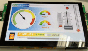

設定工控情境
=============================

.. contents:: Table of Contents

Screen Layout Log Analysis
---------------------------------

The  Screen  layout  described  in  this  section  is  intended  to  demonstrate  the  setup  of  each 
screen item that can be used on the main screen. This is the same layout as provided in the 
generic supplied display. 

以下log內容是使用busmaster + usbtoCan dogle 捉取log資料，目的是展示傳送以下canbus訊息，讓smart display 呈現
工控情境畫面。

I'm not good than that.

Step Wait Node ID heat beat msg
---------------------------------------

Step 1 Switch Pre-Operation Mode
---------------------------------------

.. |CanOpen_Form| image:: ./images/CanOpen_Form.png
      :scale: 100%

|CanOpen_Form|

Step 2 Set up Object 
-------------------------

Set up Obj Index 0x2000
^^^^^^^^^^^^^^^^^^^^^^^^^^

Set up Obj Index 0x2001
^^^^^^^^^^^^^^^^^^^^^^^^^

Step 3 Switch Operation Mode
-------------------------------

Step 4 Complete
-------------------------