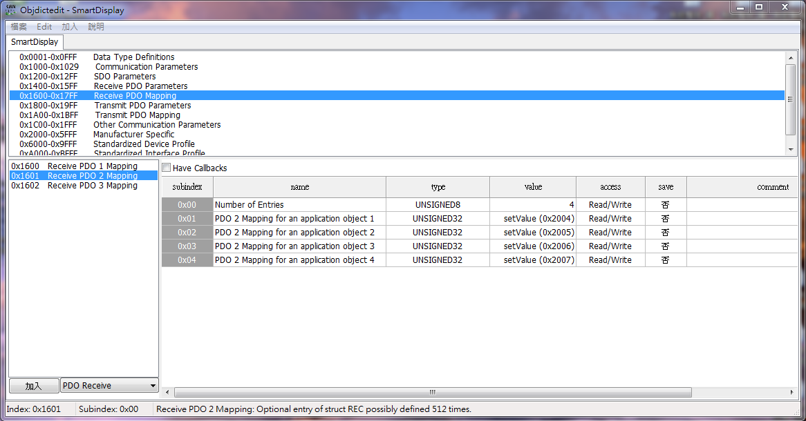
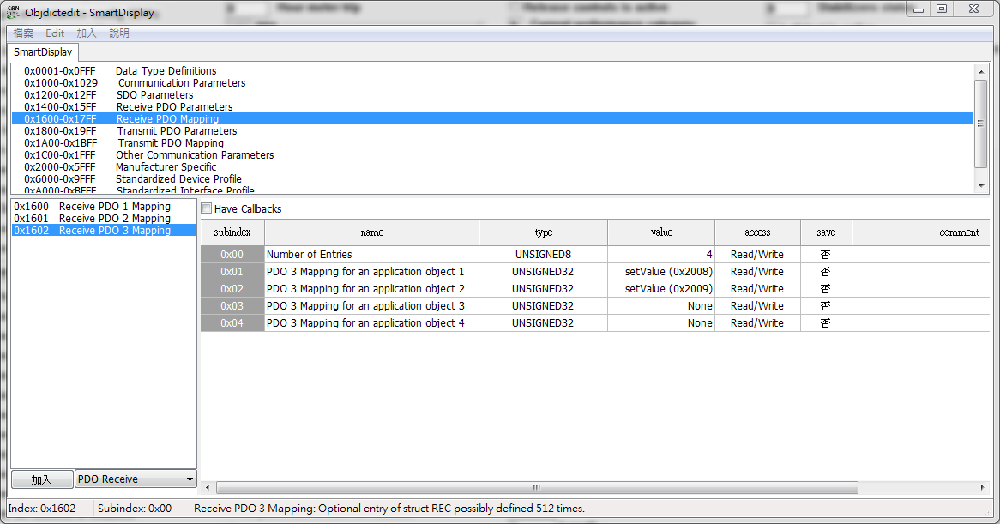

object dictionary
=============================

.. contents:: Table of Contents

Introduction
-------------
..
  SamrtDisplay5 Interface is Canbus.
  All graphic is updated by CANBUS-Interface.

Object Index
-----------------
..

  There are 10 OD entries which are for configuration of the items that can be displayed on 
  the screen. These are at location 0x2000 to 0x2009. 
  Each item has a set of sub-index items which are used to control the appearance of the item. 
  The exact functionality varies depending on the type of item selected. The struct of object is 
  shown below: 

  +-------------------------+-------------+-------+ 
  | **Object Index 0x2000** |Description  | Value |
  | **to 0x2009**           |             |       |
  +=========================+=============+=======+
  | Sub 1                   | Type        |       |
  +-------------------------+-------------+-------+
  | Sub 3                   | X position  |       |
  +-------------------------+-------------+-------+
  | Sub 4                   | Y position  |       |
  +-------------------------+-------------+-------+
  | Sub 5                   | Style       |       |
  +-------------------------+-------------+-------+
  | Sub 7                   | Set value   |       |
  +-------------------------+-------------+-------+
  | Sub 8                   | Get value   |       |
  +-------------------------+-------------+-------+
  
  Provide EDS File as below.

  :download:`download SmartDisplay.eds <./file/SmartDisplay.eds>`

Sub 1 - Type
-------------

..

  The item type is selected according to the table below.

  +-------------------------+------------------+-------+
  | **Type**                |Description       | Value |
  +=========================+==================+=======+
  | Reserve                 |                  |0      |
  +-------------------------+------------------+-------+
  | Reserve                 |                  |1      |
  +-------------------------+------------------+-------+
  | GAUGE                   | GAUGE            |2      |
  +-------------------------+------------------+-------+
  | Reserve                 |                  |3      |
  +-------------------------+------------------+-------+
  | BUTTON                  | BUTTON           |4      |
  +-------------------------+------------------+-------+
  | TOGGLE_BUTTON           | TOGGLE_BUTTON    |5      |
  +-------------------------+------------------+-------+
  | VerticalSlider          | VerticalSlider   |6      |
  +-------------------------+------------------+-------+
  | HorizontalSlider        | HorizontalSlider |7      |
  +-------------------------+------------------+-------+
  | CheckButton             | CheckButton      |8      |
  +-------------------------+------------------+-------+
  | Temperature             | Temperature      |9      |
  +-------------------------+------------------+-------+
  | Battery                 | Battery          |10     |
  +-------------------------+------------------+-------+
  | Graph                   | Graph            |11     |
  +-------------------------+------------------+-------+
  | Indicator               | Indicator        |12     |
  +-------------------------+------------------+-------+
  | CircleProgress          | CircleProgress   |13     |
  +-------------------------+------------------+-------+
  | ImageProgress           | ImageProgress    |14     |
  +-------------------------+------------------+-------+
  | GroupButton             | GroupButton      |15     |
  +-------------------------+------------------+-------+
  | Reserve                 |                  |16     |
  +-------------------------+------------------+-------+
  | NumberStr               | NumberStr        |17     |
  +-------------------------+------------------+-------+

Sub 5 - Style
--------------

  The Style value is selected according to the table below.

  This fill value can display diffent style.

  .. |button_0| image:: ./images/button_0.png
        :scale: 25%

  .. |button_1| image:: ./images/button_1.png
        :scale: 25%
        
  .. |button_2| image:: ./images/button_2.png
        :scale: 25%
        
  .. |button_3| image:: ./images/button_3.png
        :scale: 25%

  .. |button_4| image:: ./images/button_4.png
        :scale: 25%
        
  .. |button_5| image:: ./images/button_5.png
        :scale: 25%
        
  .. |button_6| image:: ./images/button_6.png
        :scale: 25%
        
  .. |button_7| image:: ./images/button_7.png
        :scale: 25%
        
  .. |button_8| image:: ./images/button_8.png
       :scale: 25%
        
  .. |button_9| image:: ./images/button_9.png
     :scale: 25%
        
  .. |button_10| image:: ./images/button_10.png
     :scale: 25%

  .. |Gauge_0| image:: ./images/Gauge_0.png
     :scale: 20%
            
  .. |Gauge_1| image:: ./images/Gauge_1.png
    :scale: 20%
        
  .. |Gauge_2| image:: ./images/Gauge_2.png
    :scale: 20%
    
  .. |Gauge_3| image:: ./images/Gauge_3.png
        :scale: 20%
            
  .. |Gauge_4| image:: ./images/Gauge_4.png
    :scale: 20%
        
  .. |Gauge_5| image:: ./images/Gauge_5.png
    :scale: 20%  
      
  .. |Temperature_0| image:: ./images/Temperature_0.png
    :scale: 15%  
    
  .. |Temperature_1| image:: ./images/Temperature_1.png
    :scale: 15%

  .. |Temperature_2| image:: ./images/Temperature_2.png
    :scale: 15%
    
  .. |Temperature_3| image:: ./images/Temperature_3.png
    :scale: 15%
    
  .. |Circle_0| image:: ./images/CircleProgress_0.png
    :scale: 25%
    
  .. |Circle_1| image:: ./images/CircleProgress_1.png
    :scale: 25%

  +---------------+-----------------------------------------------------------------------------------------------+
  |**type**       |**Style Valeu**                                                                                |
  +===============+=================+================+===============+===============+===============+============+
  |               |*0*              |   *1*          |   *2*         |   *3*         |  *4*          | *5*        |
  +               +-----------------+----------------+---------------+---------------+---------------+------------+
  |Gauge          ||Gauge_0|        | |Gauge_1|      | |Gauge_2|     | |Gauge_3|     | |Gauge_4|     | |Gauge_5|  |
  +---------------+-----------------+----------------+---------------+---------------+---------------+------------+
  |               |*0*              |*1*             |*2*            |*3*            |*4*            |*5*         |
  +               +-----------------+----------------+---------------+---------------+---------------+------------+
  |               ||button_0|       | |button_1|     | |button_2|    | |button_3|    | |button_4|    | |button_5| |
  +               +-----------------+----------------+---------------+---------------+---------------+------------+
  |               |*6*              |*7*             |*8*            |*9*            |*10*           |            |
  +Button         +-----------------+----------------+---------------+---------------+---------------+------------+
  |/Toggle Button ||button_6|       | |button_7|     | |button_8|    | |button_9|    | |button_10|   |            |
  +---------------+-----------------+----------------+---------------+---------------+---------------+------------+
  |               |*0*              |*1*             |*2*            | *3*           |               |            |
  +               +-----------------+----------------+---------------+---------------+---------------+------------+
  |Temperature    ||Temperature_0|  ||Temperature_1| ||Temperature_2|||Temperature_3||                            |
  +---------------+-----------------+----------------+---------------+---------------+---------------+------------+
  |               |*0*              |*1*             |               |               |               |            |
  +---------------+-----------------+----------------+---------------+---------------+---------------+------------+
  |CircleProgress ||Circle_0|       ||Circle_1|      |               |               |                            |
  +---------------+-----------------+----------------+---------------+---------------+---------------+------------+

PDO Map
----------

  

.. 

  **PDO1 Mapping**

  |PDO_1|

  **PDO2 Mapping**

  |PDO_2|

  **PDO3 Mapping**

  |PDO_3|
