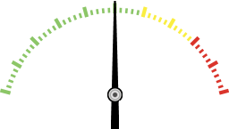
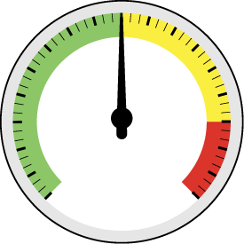
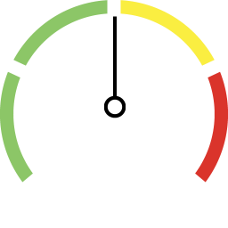

object dictionary
=============================

.. contents:: Table of Contents

Object Index
-----------------

Object Description
------------------

+-------------------------+-------------+-------+ 
| **Object Index 0x2000** |Description  | Value |
| **to 0x200A**           |             |       |
+=========================+=============+=======+
| Sub 1                   | Type        |       |
+-------------------------+-------------+-------+
| Sub 3                   | X position  |       |
+-------------------------+-------------+-------+
| Sub 4                   | Y position  |       |
+-------------------------+-------------+-------+
| Sub 5                   | Style       |       |
+-------------------------+-------------+-------+
| Sub 7                   | Set value   |       |
+-------------------------+-------------+-------+
| Sub 8                   | Get value   |       |
+-------------------------+-------------+-------+

Type
---------

.. role:: red

I like color :red:`rubric`.

.. role:: red

+-------------------------+------------------+-------+
| **Type**                |Description       | Value |
+=========================+==================+=======+
| reserve                 |                  |0      |
+-------------------------+------------------+-------+
| reserve                 |                  |1      |
+-------------------------+------------------+-------+
| :red:`GAUGE`            | GAUGE            |2      |
+-------------------------+------------------+-------+
| reserve                 |                  |3      |
+-------------------------+------------------+-------+
| BUTTON                  | BUTTON           |4      |
+-------------------------+------------------+-------+
| TOGGLE_BUTTON           | TOGGLE_BUTTON    |5      |
+-------------------------+------------------+-------+
| VerticalSlider          | VerticalSlider   |6      |
+-------------------------+------------------+-------+
| HorizontalSlider        | HorizontalSlider |7      |
+-------------------------+------------------+-------+
| CheckButton             | CheckButton      |8      |
+-------------------------+------------------+-------+
| Temperature             | Temperature      |9      |
+-------------------------+------------------+-------+
| Battery                 | Battery          |10     |
+-------------------------+------------------+-------+
| Graph                   | Graph            |11     |
+-------------------------+------------------+-------+
| Indicator               | Indicator        |12     |
+-------------------------+------------------+-------+
| CircleProgress          | CircleProgress   |13     |
+-------------------------+------------------+-------+
| ImageProgress           | ImageProgress    |14     |
+-------------------------+------------------+-------+
| GroupButton             | GroupButton      |15     |
+-------------------------+------------------+-------+
| reserve                 |                  |16     |
+-------------------------+------------------+-------+
| NumberStr               | NumberStr        |17     |
+-------------------------+------------------+-------+

.. code-block:: c

   typedef enum{
    
     TYPE_EMPTY = 0,
     TYPE_IMAGE = 1,
     TYPE_GAUGE,
     TYPE_BDI,
     TYPE_BUTTON,
     TYPE_TOGGLE_BUTTON,
     TYPE_VerticalSlider,
     TYPE_HorizontalSlider,
     TYPE_CheckButton,
     TYPE_Temperature,
     TYPE_Battery,
     TYPE_Graph,
     TYPE_Indicator,
     TYPE_CircleProgress,
     TYPE_ImageProgress,
     TYPE_GroupButton,
     TYPE_AnimatedImage,
     TYPE_NumberStr, 
     
  } OBJECT_TYPE;

Style
---------

      

      

      

      

      

      
.. |button_8| image:: ./images/button_8.png
     :scale: 25%
      

      
.. |button_10| image:: ./images/button_10.png
   :scale: 25%

          
.. |Gauge_1| image:: ./images/Gauge_1.png
  :scale: 25%
      

  

          
.. |Gauge_4| image:: ./images/Gauge_4.png
  :scale: 15%
      
.. |Gauge_5| image:: ./images/Gauge_5.png
  :scale: 15%  

+--------------+------------------------------------------------------------------------------------------------+
|Sub 1         |Description                                                                                     |
+==============+================================================================================================+
|Image         |Simon                                                                                           |
+--------------+----------------+---------------+---------------+---------------+---------------+---------------+
|              |*0*             |   *1*         |   *2*         |   *3*         |  *4*          | *5*           |
+              +----------------+---------------+---------------+---------------+---------------+---------------+
|Gauge         ||Gauge_0|       | |Gauge_1|     | |Gauge_2|     | |Gauge_3|     | |Gauge_4|     | |Gauge_5|     |
+--------------+----------------+---------------+---------------+---------------+---------------+---------------+
|              |*0*             |*1*            |*2*            |*3*            |*4*            |*5*            |
+              +----------------+---------------+---------------+---------------+---------------+---------------+
|              ||button_0|      | |button_1|    | |button_2|    | |button_3|    | |button_4|    | |button_5|    |
+              +----------------+---------------+---------------+---------------+---------------+---------------+
|              |*6*             |*7*            |*8*            |*9*            |*10*           |               |
+              +----------------+---------------+---------------+---------------+---------------+---------------+
|Button        ||button_6|      | |button_7|    | |button_8|    | |button_9|    | |button_10|   |               |
+--------------+----------------+---------------+---------------+---------------+---------------+---------------+
|Toggle Button |A                                                                                               |
+--------------+----------------+---------------+---------------+---------------+---------------+---------------+
|Write Value   |A                                                                                               |
+--------------+----------------+---------------+---------------+---------------+---------------+---------------+
|Current Value |A                                                                                               |
+--------------+----------------+---------------+---------------+---------------+---------------+---------------+

PDO Map
----------

