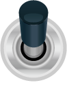

Screen Layout Log
=============================

.. contents:: Table of Contents

..

  The Screen layout described is intended to demonstrate 
  the setup of the vehicle situation that can use on the **SmartDisplay 5**.
  
  .. note::
  
    The log analysis further indicates that shows the control of each object parameter ``behavior type``, 
    ``x``, ``y``, ``style`` through the CANopen ``SDO``, ``NMT`` in the following content.

    

1. Switch Pre-Operation Mode
---------------------------------------

  To put a node **0x7B** in pre-operational mode 
  
  +--------+------+------------------------+
  |COB-ID  |DLC   |Data Byte(s)            |
  +========+======+========================+
  |0x000   |2     |80 7B                   |
  +--------+------+------------------------+

  .. tip::
  
    The COB-ID is the 11-bit id of a CAN-frame as a communication object identifier in CANopen.
    The node id **0x7B** is **SmartDisplay5** CANopen id.

2. Setup Object 
-------------------------

Setup Obj Index 0x2000
^^^^^^^^^^^^^^^^^^^^^^^^^^

subIndex 0x01(Item Type)
"""""""""""""""""""""""""

  The Host send item value ``2`` to **object index** 0x2000 **subindex** 0x01 through 
  CANopen ``SDO``

  +--------+------+------------------------+---------------------------+
  |COB-ID  |DLC   |Data Byte(s)            |Packet Direction           |
  +========+======+========================+===========================+
  |0x67B   |8     |2B 00 20 01 02 00 00 00 | **Host -> SmartDisplay5** |
  +--------+------+------------------------+---------------------------+
  |0x5FB   |7     |60 00 20 01 00 00 00 00 | **SmartDisplay5 -> Host** |
  +--------+------+------------------------+---------------------------+
  
  .. note::
  
    the item value **2** is type **Gauge**

subIndex 0x03(position X)
"""""""""""""""""""""""""

  The Host send position X value ``0x17`` to **object index** 0x2000 **subindex** 0x03 through 
  CANopen ``SDO``.
  
  +--------+------+------------------------+---------------------------+
  |COB-ID  |DLC   |Data Byte(s)            |Packet Direction           |
  +========+======+========================+===========================+
  |0x67B   |8     |2B 00 20 03 17 00 00 00 | **Host -> SmartDisplay5** |
  +--------+------+------------------------+---------------------------+
  |0x5FB   |7     |60 00 20 03 00 00 00 00 | **SmartDisplay5 -> Host** |
  +--------+------+------------------------+---------------------------+

subIndex 0x04(position Y)
"""""""""""""""""""""""""

  The Host send position Y value ``0x49`` to **object index** 0x2000 **subindex** 0x04 through 
  CANopen ``SDO``.

  +--------+------+------------------------+---------------------------+
  |COB-ID  |DLC   |Data Byte(s)            |Packet Direction           |
  +========+======+========================+===========================+
  |0x67B   |8     |2B 00 20 04 49 00 00 00 | **Host -> SmartDisplay5** |
  +--------+------+------------------------+---------------------------+
  |0x5FB   |7     |60 00 20 04 00 00 00 00 | **SmartDisplay5 -> Host** |
  +--------+------+------------------------+---------------------------+

subIndex 0x05(Style)
"""""""""""""""""""""""""

  The Host send position Y value ``0x49`` to **object index** 0x2000 **subindex** 0x05 through 
  CANopen ``SDO``.

  +--------+------+------------------------+---------------------------+
  |COB-ID  |DLC   |Data Byte(s)            |Packet Direction           |
  +========+======+========================+===========================+
  |0x67B   |8     |2B 00 20 05 05 00 00 00 | **Host -> SmartDisplay5** |
  +--------+------+------------------------+---------------------------+
  |0x5FB   |7     |60 00 20 05 00 00 00 00 | **SmartDisplay5 -> Host** |
  +--------+------+------------------------+---------------------------+
  
  .. |Gauge_5| image:: ./images/Gauge_5.png
    :scale: 5%
    
  .. note ::
    
    Filling a parameter **0x05** |Gauge_5| is for selecting **style** in **Gauge** type **0x02** 
    which set at postion x = **0x17** , y = **0x49** in **0x2000** object.
  

Update Object 0x2001~0x2009 
""""""""""""""""""""""""""""""""""""""""""""""""""
  

  

  

  

  

  
.. 

  This update object 0x2001 ~ 0x2009 through **CANopen** ``SDO`` in the picture below.

  .. image:: ./images/Vehicle_Obj2001.png    

  .. |br| raw:: html
    
     
    
  |br| Writing values **type** = 0xA, **style** = 0x01, **coordinates (x,y)** = (0x19, 0x1F) to 
  sub-index 0x01, 0x05, 0x03, 0x04 in **Object** 0x2001 that can display Battery Object |Battery_1|
    
  .. image:: ./images/Vehicle_Obj2002.png
    
  |br| Writing values **type** = 0x09, **style** = 0x02, **coordinates (x,y)** = (0x0F, 0x8C) to 
  sub-index 0x01, 0x05, 0x03, 0x04 in **Object** 0x2002 that can display Temperature Object |Temperature_2|
   
  .. image:: ./images/Vehicle_Obj2003.png
        
  |br| Writing values **type** = 0x05, **style** = 0x0A, **coordinates (x,y)** = (0xD4, 0x1A) to 
  sub-index 0x01, 0x05, 0x03, 0x04 in **Object** 0x2003 that can display Toggle Button Object |button_10|
      
  .. image:: ./images/Vehicle_Obj2004.png
     
  |br| Writing values **type** = 0x05, **style** = 0x08, **coordinates (x,y)** = (0xB2, 0x98) to 
  sub-index 0x01, 0x05, 0x03, 0x04 in **Object** 0x2004 that can display Toggle Button Object |button_8|
      
  .. image:: ./images/Vehicle_Obj2005.png
   
  |br| Writing values **type** = 0x0C, **style** = 0x00, **coordinates (x,y)** = (0x6B, 0x2E) to 
  sub-index 0x01, 0x05, 0x03, 0x04 in **Object** 0x2005 that can display Indicator Object |Indicator_0|
      
  .. image:: ./images/Vehicle_Obj2006.png
      
  |br| put the object **0x2006**, set the item type **empty**.

  .. image:: ./images/Vehicle_Obj2007.png

  |br| put the object **0x2007**, set the item type **empty**.
    
  .. image:: ./images/Vehicle_Obj2008.png
    
  |br| put the object **0x2008**, set the item type **empty**.
    
  .. image:: ./images/Vehicle_Obj2009.png

  |br| put the object **0x2009**, set the item type **empty**.

3. Setup Operation Background
---------------------------------------------

  .. |background_Industry| image:: ./images/background_Industry.png
   :scale: 15%

  .. |background_Vehicle| image:: ./images/background_Vehicle.png
   :scale: 15%

  .. |background_Medical| image:: ./images/background_Medical.png
   :scale: 15%

  
  The operation background image is selected using an object \ **0x2100** \ as below. 

  +-------------------------+----------------------+----------------------+ 
  | **0x00**  Industry      |**0x01**  Vehicle     |**0x02**  Medical     |
  +=========================+======================+======================+
  | |background_Industry|   | |background_Vehicle| | |background_Vehicle| |
  +-------------------------+----------------------+----------------------+

  Select Picture value **0x01** to setting backgruond picturen at operation-mode through Canopne ``SDO``.

  +--------+------+------------------------+---------------------------+
  |COB-ID  |DLC   |Data Byte(s)            |Packet Direction           |
  +========+======+========================+===========================+
  |0x67B   |8     |2F 00 21 00 01 00 00 00 | **Host -> SmartDisplay5** |
  +--------+------+------------------------+---------------------------+
  |0x5FB   |8     |60 00 21 00 00 00 00 00 | **SmartDisplay5 -> Host** |
  +--------+------+------------------------+---------------------------+

4. Switch Operation Mode
-------------------------------
  
.. epigraph::

  To put a node 0x7B **SmartDisplay5** in operational mode 
  
  +--------+------+------------------------+
  |COB-ID  |DLC   |Data Byte(s)            |
  +========+======+========================+
  |0x000   |2     |01 7B                   |
  +--------+------+------------------------+
  
  you can see vehicle layout screen at **smartdiplay5**.

  .. image:: ./images/Vehicle_total_set.png
    
5. Control **SmartDisplay5**
----------------------------------

.. sidebar:: Control Gauge of Vehicle Dashboard 

   .. image:: ./images/vehicle-animation.gif

..

    Write Object index 0x2000 subindx 0x07 ``set value`` \ **0~100** \ through CANopen ``PDO``
    that can control gauge which shown as right animation.

